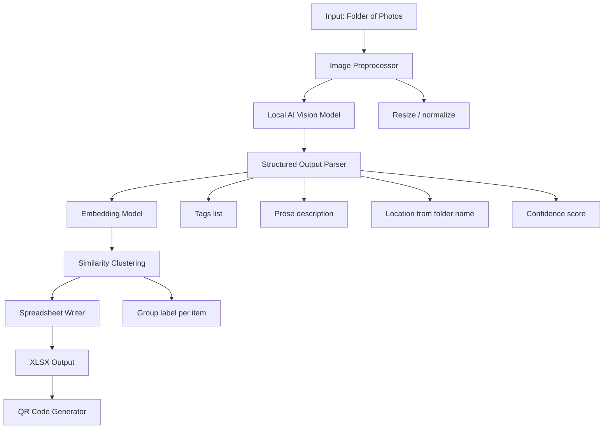

# Inventory Machine Plan

## Core Architecture



---

## Data Schema

Each row in the spreadsheet represents one photo/item.

| Column | Source | Notes |
|---|---|---|
| `item_id` | Generated UUID | Stable identifier for QR link |
| `filename` | Filesystem | Original filename |
| `location` | Parent folder name | Editable later |
| `tags` | AI output | Comma-separated, filterable |
| `description` | AI output | 2-4 sentence prose |
| `confidence` | Weighted composite | Float 0.0-1.0 |
| `confidence_flag` | Derived | `low` if below threshold, else blank |
| `group_label` | Clustering | Human-readable cluster name |
| `group_id` | Clustering | Integer cluster index |
| `image_path` | Filesystem | Absolute or relative |
| `qr_url` | Derived | `<BASE_URL>/item/<item_id>` |
| `date_processed` | System time | ISO 8601, configurable tz |

---

## AI Components

### Vision Model: `<VISION_MODEL>`

Called once per image with a structured prompt requesting JSON output. Candidates: LLaVA 1.6, Qwen2-VL, Moondream2. Ollama is the simplest local serving layer for all three. Qwen2-VL has the best accuracy; Moondream2 is fastest on CPU.

Prompt JSON structure:

```json
{
  "tags": ["tag1", "tag2"],
  "description": "2-4 sentences covering color, material, condition, approximate size.",
  "confidence": 0.85
}
```

Force JSON mode in Ollama via `"format": "json"` in the request body.

#### Vision Prompt Template

Stored in a separate file (path set in config) to keep the ini uncluttered.

```
System: You are an inventory assistant. Respond only with valid JSON, no markdown.

User: Describe the object(s) in this image.
Return exactly this structure:
{
  "tags": ["tag1", "tag2", ...],   // 5-15 specific, lowercase noun/adjective tags
  "description": "...",            // 2-4 sentences, include color, material, condition, approximate size
  "confidence": 0.0                // float 0.0-1.0, your certainty about the identification
}
```

### Embedding Model: `<EMBED_MODEL>`

Converts concatenated tags + description into a vector for similarity clustering. Text-only is sufficient; multimodal embeddings are not needed because the vision model already converted images to text. Candidates: `nomic-embed-text` via Ollama, or `all-MiniLM-L6-v2` via `sentence-transformers` locally. Nomic has better quality; MiniLM is faster and needs no Ollama dependency.

### Clustering

HDBSCAN over the embedding matrix. Does not require a pre-specified number of clusters and handles noise points, which suits a heterogeneous inventory. Noise points receive `group_id = -1`. After clustering, the 3 most central items per cluster are sent back to `<VISION_MODEL>` with a short prompt to generate a human-readable group label.

---

## Confidence Score

Vision models do not emit calibrated probabilities natively. Confidence is synthesized from two signals:

1. **Model self-report**: The `confidence` field in the JSON output (0.0-1.0). Captures obvious low-confidence cases: blurry, occluded, or ambiguous images.
2. **Tag coherence**: Mean pairwise cosine similarity across the tag embeddings. High variance signals the model hedged across unrelated concepts.

Final score:

```
confidence = (self_report_weight * self_report) + (tag_coherence_weight * tag_coherence)
```

Weights are set in config and must sum to 1.0. Items below `low_confidence_threshold` get `confidence_flag = "low"`, which allows filtering in Excel/Sheets without parsing floats.

---

## Folder-to-Location Mapping

The folder name becomes the initial `location` field. A flat input structure works best:

```
inventory_input/
    garage_shelf_a/
        img001.jpg
        img002.jpg
    kitchen_drawer/
        img003.jpg
```

Nested folders are joined with the `folder_separator` from config (default ` > `), e.g. `garage > shelf_a`. Configurable prefix strings are stripped from folder names before use.

---

## QR Code Strategy

Each item gets a UUID at processing time. The QR code encodes:

```
<BASE_URL>/item/3f2a1b4c-...
```

Two viable targets:

| Target | Pros | Cons |
|---|---|---|
| Local Flask app | Scales well; searchable UI | Requires server running at scan time |
| Spreadsheet anchor | No extra server | Google Sheets only; Excel anchors are fragile |

The Flask approach is more robust long-term. QR PNGs are saved to `qr_output/<item_id>.png` and optionally embedded as thumbnails in the XLSX.

---

## Timestamps

`date_processed` is written at row-write time using:

```python
from datetime import datetime, timezone

def get_timestamp(cfg: configparser.ConfigParser) -> str:
    tz = timezone.utc if cfg.get("output", "timestamp_timezone") == "utc" else None
    fmt = cfg.get("output", "timestamp_format")
    return datetime.now(tz).strftime(fmt)
```

Passing `tz=None` gives local time. For named timezones (e.g. `America/Chicago`), swap in `zoneinfo.ZoneInfo` later.

---

## Config File

```ini
[paths]
input_dir = ./inventory_input
output_xlsx = ./inventory_output/inventory.xlsx
qr_output_dir = ./inventory_output/qr_codes
log_file = ./inventory_output/run.log

[models]
vision_model = <VISION_MODEL>
embedding_model = <EMBED_MODEL>
ollama_base_url = http://localhost:11434

[vision]
max_retries = 3
image_max_px = 1024
json_mode = true
; Prompt template file path -- keeps the ini uncluttered
prompt_template = ./prompts/vision_prompt.txt

[confidence]
self_report_weight = 0.6
tag_coherence_weight = 0.4
low_confidence_threshold = 0.5

[clustering]
min_cluster_size = 2
min_samples = 1
; epsilon = 0 means HDBSCAN auto-selects
epsilon = 0.0

[output]
embed_thumbnails = true
thumbnail_px = 128
qr_base_url = <BASE_URL>
main_sheet = Inventory
cluster_sheet = Clusters
; Options: utc, local
timestamp_timezone = utc
; strftime format -- double %% required; configparser eats single %
timestamp_format = %%Y-%%m-%%dT%%H:%%M:%%S

[location]
folder_separator = >
; Comma-separated strings to strip from folder names before use as location
strip_prefixes = img_, scan_, batch_
```

### Config Loading

```python
# config.py
import configparser
from pathlib import Path

def load_config(path: str = "config.ini") -> configparser.ConfigParser:
    cfg = configparser.ConfigParser(
        interpolation=configparser.BasicInterpolation(),
        inline_comment_prefixes=(";",),
    )
    read = cfg.read(path)
    if not read:
        raise FileNotFoundError(f"Config not found: {path}")
    return cfg

def get_confidence_weights(cfg: configparser.ConfigParser) -> tuple[float, float]:
    w1 = cfg.getfloat("confidence", "self_report_weight")
    w2 = cfg.getfloat("confidence", "tag_coherence_weight")
    if abs(w1 + w2 - 1.0) > 1e-6:
        raise ValueError(f"Confidence weights must sum to 1.0, got {w1 + w2}")
    return w1, w2
```

Weight validation runs at startup, not at scoring time -- fail fast on misconfiguration. Pass the `cfg` object rather than re-reading the file; the single-read pattern also makes testing easier since you can inject a `ConfigParser` built from a string.

---

## Implementation Stack

```
Python 3.11+
├── ollama                  # local model serving (vision + embeddings)
├── Pillow                  # image preprocessing
├── httpx                   # async calls to Ollama API
├── sentence-transformers   # alt embedding path (no Ollama needed)
├── hdbscan                 # clustering
├── scikit-learn            # fallback: KMeans, PCA for debug viz
├── openpyxl                # XLSX write
├── qrcode[pil]             # QR generation
└── flask                   # optional: local search UI
```

---

## Processing Pipeline

1. **Walk input directory** -- collect all `.jpg/.png/.webp` paths; record parent folder as location.
2. **Preprocess** -- resize to max `image_max_px` on longest side.
3. **Vision inference** -- POST each image to `<VISION_MODEL>` via Ollama with JSON-mode prompt. Retry up to `max_retries` on malformed output.
4. **Embed** -- run `<EMBED_MODEL>` on `tags joined as string + " " + description` for each item.
5. **Score confidence** -- compute tag coherence via pairwise cosine similarity; combine with model self-report using configured weights.
6. **Cluster** -- HDBSCAN on embedding matrix. Noise points get `group_id = -1`.
7. **Label clusters** -- for each cluster, pick the 3 most central items, send their tags to `<VISION_MODEL>`: "Given these tag sets, give a 2-4 word label for this group of objects."
8. **Write XLSX** -- `Inventory` sheet with all rows; `Clusters` sheet with cluster summary. Write `date_processed` at row-write time.
9. **Generate QRs** -- one PNG per item saved to `qr_output_dir`; optionally embed thumbnails in XLSX.

---

## Open Decisions

| Decision | Options | Tradeoff |
|---|---|---|
| Vision model | LLaVA 1.6 7B, Qwen2-VL 7B, Moondream2 | Qwen2-VL best accuracy; Moondream2 fastest on CPU |
| Embedding model | `nomic-embed-text`, `all-MiniLM-L6-v2` | Nomic better quality; MiniLM faster, no Ollama needed |
| QR target | Local Flask app vs. spreadsheet anchor | Flask scales better; sheet anchor needs no extra server |
| Spreadsheet host | Local XLSX vs. Google Sheets | Google Sheets enables live search; XLSX is fully offline |
| Multi-object images | One row per photo vs. one row per detected object | Per-object needs a detection step; per-photo is simpler to start |

The vision model choice is the most consequential; everything else can be swapped without restructuring the pipeline.
